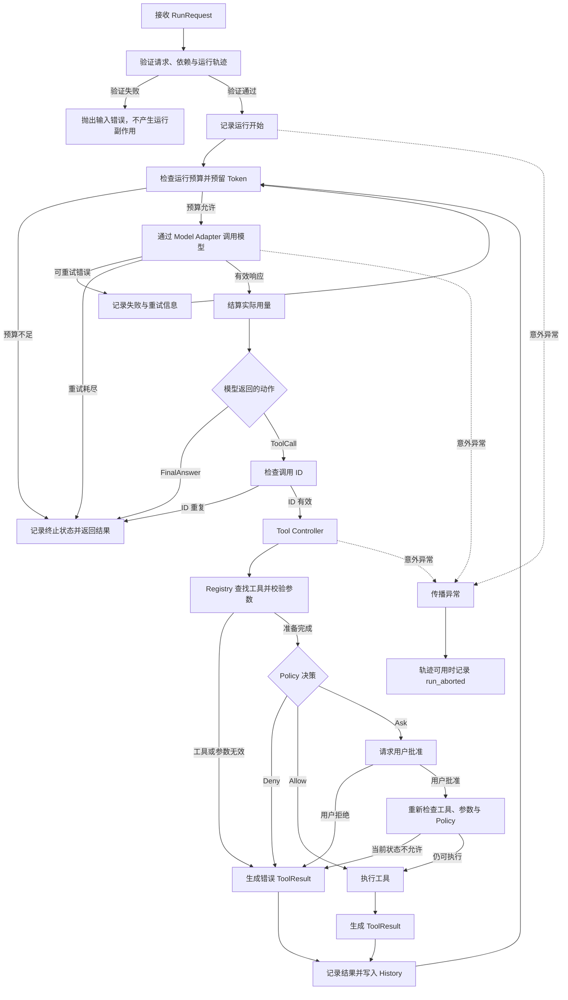

# Issue-to-Patch Code Agent

## 项目简介

Issue-to-Patch Code Agent 是一个面向软件问题修复的单 Agent Kernel。项目从执行内核开始，先解决模型如何调用、动作如何受控、资源如何计算，以及运行过程如何追踪，再逐步扩展代码检索、补丁生成和测试验证能力。

v0 已经建立一条完整的 Agent 执行链：模型读取上下文后返回最终答案或提出工具调用，Kernel 根据预算、工具状态和权限策略决定是否继续，并将工具结果交给模型完成下一轮推理。

项目将模型决策、系统授权和环境执行分开。模型只能提出动作，不能直接获得工具执行权；用户批准后，系统仍会重新检查工具与权限。模型调用产生的资源消耗不会因失败而被撤销，无法确认的消费会保留为未知状态。运行轨迹也会区分准备执行、提出请求和实际完成，避免根据意图事件推断外部操作已经发生。

当前版本仍是同步、单进程的初版内核，尚未完成完整的 Issue-to-Patch 工作流。代码检索、文件修改、隔离执行、跨运行恢复和真实修复任务评测是后续开发重点。

## 核心流程

模型只负责生成 `FinalAnswer` 或 `ToolCall`。预算模块决定运行能否继续，Tool Controller 负责工具准备和权限判断，实际结果写入 History 后再交给模型。任何一步发生意外异常都会停止循环；可预期的预算耗尽和模型失败则通过结构化终态返回。

## 模块分区

### Agent Loop

Agent Loop 是 Kernel 的控制中心，负责连接模型调用、工具执行、人工审批、运行历史和终止状态。

它维护一次运行的状态变化，判断模型返回的是最终答案还是工具调用，并在每轮操作前检查预算和时间。正常完成、预算停止、模型失败与程序异常分别使用不同的结果表达。

### Model Adapter

Model Adapter 隔离 Kernel 与具体模型协议。不同模型服务可以使用不同的请求和响应格式，但进入 Kernel 后都会被转换成统一的模型响应、工具调用、Token 用量和错误类型。

目前已经接入 Fake Model 和 DeepSeek。Fake Model 用于确定性测试，真实模型用于验证完整工具循环。

### Run Budget

Run Budget 管理一次 Agent 运行允许使用的资源，包括模型调用次数、行动步数、Token 和运行时间。

每次模型请求都会先申请预算，响应返回后再记录实际用量。调用失败时，系统根据已知的消费状态决定释放、结算或保留预留额度。Provider 故障和模型输出错误分别计算重试次数，每次重试都要重新通过预算检查。

### Tool System

Tool System 负责管理模型可以请求的外部能力，由 Registry、Runtime、Policy 和 Approval 组成。

Registry 保存工具定义，Runtime 检查工具是否存在以及参数是否符合要求，Policy 决定允许、拒绝或询问用户。需要批准的工具只能使用一次对应的批准结果，并在执行前重新检查当前状态。

该分区保证模型提出工具调用并不等于工具已经获得执行权限。

### Run History

Run History 保存当前运行中模型真正需要看到的信息，包括初始消息、模型反馈、工具调用和工具结果。

历史由 Agent Loop 维护，不会反向修改调用方传入的初始请求。工具调用与结果通过 `call_id` 配对，下一轮模型可以根据真实工具结果继续推理。

### Event Store

Event Store 保存 Agent 运行过程中的结构化轨迹，用于检查资源消耗、工具决策、审批过程和终止原因。

运行轨迹与模型上下文分开：History 服务于后续推理，Event Store 服务于审计和问题定位。轨迹记录失败时，Kernel 会停止后续动作，避免在缺少关键证据的情况下继续运行。

## 后续方向

下一阶段将围绕真实代码仓库操作展开，优先加入受工作区限制的文件读取、目录浏览和文本检索工具，再实现受控补丁修改与自动化测试。

在此基础上，项目还需要补充资源上限、工具隔离、故障恢复和系统化评测，最终形成从 Issue 理解、代码定位、补丁生成到验证结果的完整工作流。
